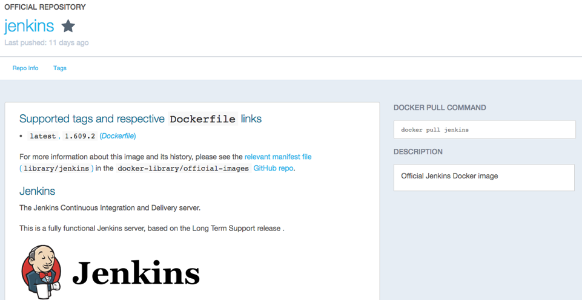
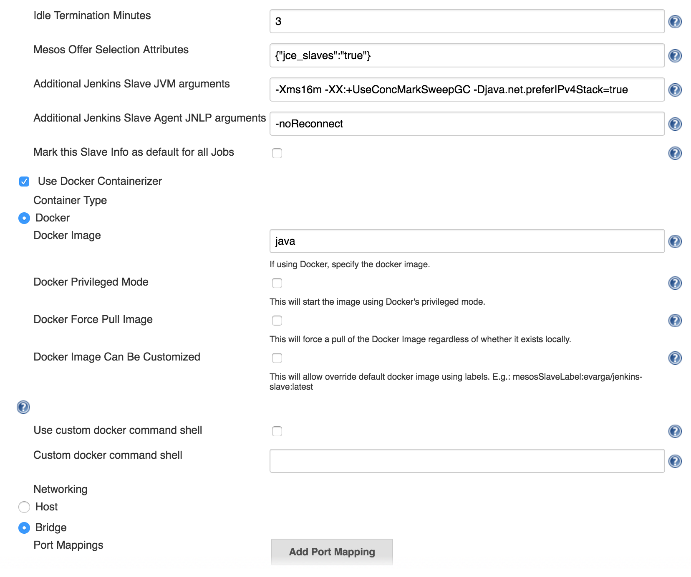
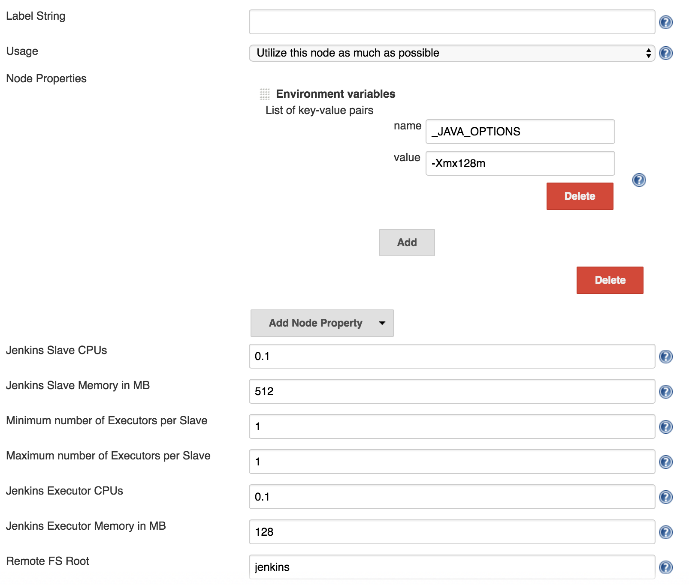

### Scaling Jenkins with Docker
## Swarm, Kubernetes or Mesos?

[Carlos Sanchez](http://csanchez.org) /
[csanchez.org](http://csanchez.org) / [@csanchez](http://twitter.com/csanchez)

<small>[Watch online at carlossg.github.io/presentations](https://carlossg.github.io/presentations)</small>

---

# About me

Engineer @ CloudBees, Private SaaS Edition Team

Contributor to 

Jenkins Mesos plugin

Jenkins and Maven official Docker images

Author of Jenkins Kubernetes plugin

Long time OSS contributor at Apache, Eclipse, Puppet,…

---

# Docker Docker Docker

----

----

## But it is not trivial

<!--

-->

----

# Cluster Scheduling

* Running in public cloud, private cloud, VMs or bare metal
* HA and fault tolerant
* With Docker support of course

----

---

# 

<q>A distributed systems kernel</q>

----

# Apache Mesos

* Started before 2011
* Runs tasks, any binary or Docker, `rkt`, `appc` images
* Frameworks run on top of Mesos
 * Mesosphere Marathon: long running services
 * Apache Aurora: long running services
 * Chronos: distributed cron-like system
* Used in Twitter, Airbnb, eBay, Apple, Verizon, Yelp,... 

---

# Docker Swarm

----

# Docker Swarm

* By Docker Inc.
* Uses the same Docker API
* No need to modify existing tooling

----

## Docker Engine Swarm mode

* New [Swarm mode](https://docs.docker.com/engine/swarm/) in Docker 1.12
* No need to install extra software, each daemon can run as a Swarm member
* New `service` object to describe distributed containers
 * Existing tooling needs to be updated

---

# 

----

# Kubernetes

* Based on Google Borg
* Run in local machine, virtual, cloud
* Google provides Google Container Engine (GKE)
* Other services run by stackpoint.io, CoreOS Tectonic, Azure,...
* Minikube for local testing

---

# Scaling Jenkins

Two options:

* More build agents per master
* More masters

----

## Scaling Jenkins: More Build Agents

* Pros

 * Multiple plugins to add more agents, even dynamically

* Cons

 * The master is still a SPOF
 * Handling multiple configurations, plugin versions,...
 * There is a limit on how many build agents can be attached

----

## Scaling Jenkins: More Masters

* Pros

 * Different sub-organizations can self service and operate independently

* Cons

 * Single Sign-On
 * Centralized configuration and operation

Covered by CloudBees Jenkins Operations Center and CloudBees Jenkins Platform Private SaaS Edition

----

----

> If you haven't automatically destroyed something by mistake, you are not automating enough

----

# Running in Docker

----

---

# Cluster Scheduling

Isolated build agents and jobs

Using Docker

Capabilities can be dropped

----

## Grouping containers

Example:

* Jenkins agent
* Maven build
* Selenium testing in
  * Firefox
  * Chrome
  * Safari

5 containers

----

## Grouping containers

<table>
  <tbody>
    <tr>
      <td>Mesos</td>
      <td>In progress [MESOS-2449](https://issues.apache.org/jira/browse/MESOS-2449)</td>
    </tr>
    <tr>
      <td>Swarm</td>
      <td>
        Supports grouping through Docker Compose 
        Can force execution in the same host
      </td>
    </tr>
    <tr>
      <td>Kubernetes</td>
      <td>
        Supports the concept of Pods natively 
        All running in the same host
      </td>
    </tr>
  </tbody>
</table>

----

## Memory limits

Scheduler needs to account for container memory requirements and host available memory

Prevent containers for using more memory than allowed

<table>
  <tbody>
    <tr>
      <td>Mesos</td>
      <td>required</td>
    </tr>
    <tr>
      <td>Swarm</td>
      <td>optional</td>
    </tr>
    <tr>
      <td>Kubernetes</td>
      <td>optional (plus namespaces)</td>
    </tr>
  </tbody>
</table>

Memory constrains translate to Docker [--memory](https://docs.docker.com/engine/reference/run/#runtime-constraints-on-resources)

----

### What do you think happens when?

Your container goes over memory quota?

----

----

### What about the JVM?

### What about the child processes?

----

## CPU limits

Scheduler needs to account for container CPU requirements and host available CPUs

<table>
  <tbody>
    <tr>
      <td>Mesos</td>
      <td>required</td>
    </tr>
    <tr>
      <td>Swarm</td>
      <td>optional</td>
    </tr>
    <tr>
      <td>Kubernetes</td>
      <td>optional (plus namespaces)</td>
    </tr>
  </tbody>
</table>

CPU translates into Docker [`--cpu-shares`](https://docs.docker.com/engine/reference/run/#runtime-constraints-on-resources)

----

### What do you think happens when?

Your container tries to access more than one CPU

Your container goes over CPU limits

----

Totally different from memory

----

## Storage

Handling distributed storage

Jenkins masters need persistent storage, agents (_typically_) don't

<table>
  <tbody>
    <tr>
      <td>Mesos</td>
      <td>[Docker volume support](https://mesos.apache.org/documentation/latest/docker-volume/) in 1.0+</td>
    </tr>
    <tr>
      <td>Swarm</td>
      <td>Docker volume plugins: RexRay, Convoy, Flocker,...</td>
    </tr>
    <tr>
      <td>Kubernetes</td>
      <td>[Persistent volumes](http://kubernetes.io/docs/user-guide/persistent-volumes/walkthrough/)</td>
    </tr>
  </tbody>
</table>

----

### Permissions

Containers should not run as root

Container user id != host user id

i.e. `jenkins` user in container is always 1000 but matches `ubuntu` user in host

----

### Caveats

Only a limited number of EBS volumes can be mounted <!-- .element: class="fragment" -->

Docs say `/dev/sd[f-p]`, but `/dev/sd[q-z]` seem to work too

NFS users must be centralized and match in cluster and NFS server <!-- .element: class="fragment" -->

----

# Networking

Jenkins masters open several ports

* HTTP
* JNLP Build agent
* SSH server (Jenkins CLI type operations)

Jenkins agents connect to master:

* inbound (SSH)
* outbound (JNLP)

----

Allows getting one IP per container

<table>
  <tbody>
    <tr>
      <td>Mesos</td>
      <td>[Network Isolator Modules](http://mesos.apache.org/documentation/latest/networking-for-mesos-managed-containers/): Calico, Weave</td>
    </tr>
    <tr>
      <td>Swarm</td>
      <td>[Docker overlay](https://docs.docker.com/swarm/networking/), and others from plugins</td>
    </tr>
    <tr>
      <td>Kubernetes</td>
      <td>Multiple [networking options](http://kubernetes.io/docs/admin/networking/): GCE, Weave, Calico,...</td>
    </tr>
  </tbody>
</table>

---

# Jenkins Plugins

---

## Jenkins Docker Plugins

* Dynamic Jenkins agents with Docker plugin or Yet Another Docker Plugin
  * No support yet for Docker 1.12 Swarm mode
* Agent image needs to include Java, downloads slave jar from Jenkins master
* Multiple plugins for different tasks
  * Docker build and publish
  * Docker build step plugin
  * CloudBees Docker Hub/Registry Notification
  * CloudBees Docker Traceability
* Great pipeline support

----

----

----

### Jenkins Docker Pipeline

    def maven = docker.image('maven:3.3.9-jdk-8');

    stage 'Mirror'
    maven.pull()
    docker.withRegistry('https://secure-registry/', 'docker-registry-login') {

      stage 'Build'
      maven.inside {
        sh "mvn -B clean package"
      }
      
      stage 'Bake Docker image'
      def pcImg = docker.build("examplecorp/spring-petclinic:${env.BUILD_TAG}", 'app')

      pcImg.push();
    }

----

### [Jenkins Docker Slaves Plugin](https://wiki.jenkins-ci.org/display/JENKINS/Docker+Slaves+Plugin)

Use any Docker image, no need for Java

Definition in pipeline

Can have side containers

Just released!

----

----

Building Maven

    dockerNode("maven:3.3.3-jdk-8") {
      sh "mvn -version"
    }

---

## Jenkins Mesos Plugin

* Dynamic Jenkins agents, both Docker and isolated processes
* Agent image needs to include Java, grabs slave jar from Mesos sandbox
* Can run Docker commands on the host, outside of Mesos

----

----

----

----

## Jenkins Mesos Plugin

Can use Docker pipelines with some tricks

* Need Docker client installed
* Shared docker.sock from host
* Mount the workspace in the host, visible under same dir

----

### Mesos Plugin and Pipeline

    node('docker') {
        docker.image('golang:1.6').inside {

            stage 'Get sources'
            git url: 'https://github.com/hashicorp/terraform.git', tag: "v0.6.15"

            stage 'Build'
            sh """#!/bin/bash -e
            mkdir -p /go/src/github.com/hashicorp
            ln -s `pwd` /go/src/github.com/hashicorp/terraform
            pushd /go/src/github.com/hashicorp/terraform
            make core-dev plugin-dev PLUGIN=provider-aws
            popd
            cp /go/bin/terraform-provider-aws .
            """

            stage 'Archive'
            archive "terraform-provider-aws"
        }
    }

---

## [Jenkins Kubernetes Plugin](https://wiki.jenkins-ci.org/display/JENKINS/Kubernetes+Plugin)

* Dynamic Jenkins agents, running as Pods
* Multiple container support
  * One jnlp image, others custom
* Pipeline support for both agent Pod definition and execution will be in next version

----

### Jenkins Kubernetes Pipeline

    podTemplate(label: 'mypod', containers: [
            [name: 'jnlp', image: 'jenkinsci/jnlp-slave:alpine', args: '${computer.jnlpmac} ${computer.name}'],
            [name: 'maven', image: 'maven:3-jdk-8', ttyEnabled: true, command: 'cat'],
            [name: 'golang', image: 'golang:1.6', ttyEnabled: true, command: 'cat'],
        ]) {

        node ('mypod') {
            stage 'Get a Maven project'
            git 'https://github.com/jenkinsci/kubernetes-plugin.git'
            container('maven') {
                stage 'Build a Maven project'
                sh 'mvn clean install'
            }

            stage 'Get a Golang project'
            git url: 'https://github.com/hashicorp/terraform.git'
            container('golang') {
                stage 'Build a Go project'
                sh """
                mkdir -p /go/src/github.com/hashicorp
                ln -s `pwd` /go/src/github.com/hashicorp/terraform
                cd /go/src/github.com/hashicorp/terraform && make core-dev
                """
            }
        }
    }

----

## Jenkins Plugins Recap

* Dynamic Jenkins agent creation
* Using JNLP slave jar
  * In complex environments need to use the `tunnel` option to connect internally
* Using the Cloud API
 * Not ideal for containerized workload
 * Agents take > 1 min to start provision and are kept around
 * Agents can provide more than one executor

----

## Jenkins One Shot Executor

Improved API to handle one off agents

Optimized for containerized agents

Plugins need to support it

---

# Thanks

[csanchez.org](http://csanchez.org)

 [csanchez](http://twitter.com/csanchez)

 [carlossg](https://github.com/carlossg)

