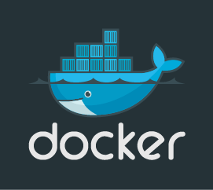
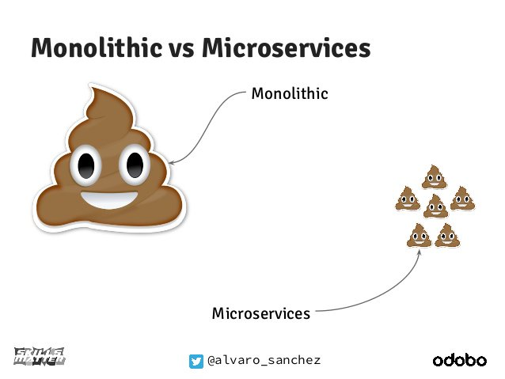
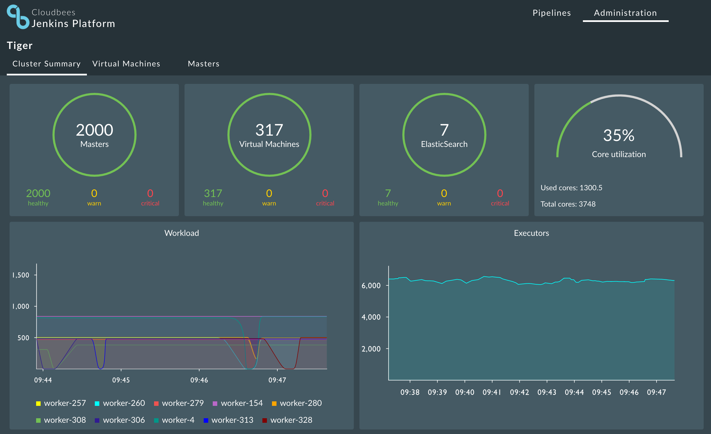
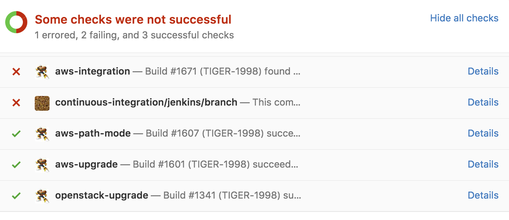
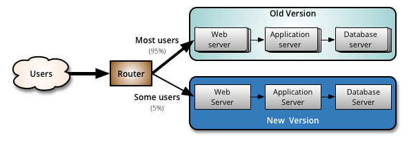

## Testing Distributed
## Micro-Services

[Carlos Sanchez](http://csanchez.org)

[@csanchez](http://twitter.com/csanchez) [csanchez.org](http://csanchez.org)


<small>[Watch online at carlossg.github.io/presentations](https://carlossg.github.io/presentations)</small>

---


# About me

Senior Software Engineer @ CloudBees

Author of Jenkins Kubernetes plugin

Long time OSS contributor at Apache Maven, Eclipse, Puppet,…

Google Cloud Platform "Expert"


---


## Docker Docker Docker




----

<!--
## But it is not trivial


-->



----


# Our use case


Scaling Jenkins

<small>Your mileage may vary</small>

----



----


----


----

## A 2000 Jenkins Masters Cluster

* 3 Mesos masters (m3.xlarge: 4 vCPU, 15GB, 2x40 SSD)
* 317 Mesos slaves (c3.2xlarge, m3.xlarge, m4.4xlarge)
* 7 Mesos slaves dedicated to ElasticSearch: (c3.8xlarge: 32 vCPU, 60GB)

**12.5 TB - 3748 CPU**

Running 2000 masters and ~8000 concurrent jobs

---


# Architecture

----


----

Isolated Jenkins masters

Isolated build agents and jobs

Memory and CPU limits

----


----


<!-- 
> How would you design your infrastructure if you couldn't login? Ever.

> Kelsey Hightower
 -->

---


# Cluster Scheduling

Distribute tasks across a cluster of hosts

HA and fault tolerant

With Docker support of course

----

# Infrastructure

Running in public cloud, private cloud, VMs or bare metal


<!--

-->

----

## Apache Mesos & Mesosphere Marathon


<q>A distributed systems kernel</q>


----

## Alternatives


Docker Swarm / Kubernetes


<!--

<iframe width="560" height="315" src="https://www.youtube.com/embed/PivpCKEiQOQ?rel=0&start=15" frameborder="0" allowfullscreen></iframe>


-->

---


# "Unit" Testing Docker Images

----

## The Dockerfile

A lot like a shell script

`RUN` comands

`COPY` files

...

----

# Dockerfile

    FROM openjdk:8-jdk

    RUN apt-get update && apt-get install -y git curl && rm -rf /var/lib/apt/lists/*

    ARG JENKINS_VERSION
    ENV JENKINS_VERSION ${JENKINS_VERSION:-2.19.3}
    ARG JENKINS_SHA=e97670636394092af40cc626f8e07b092105c07b

    ARG JENKINS_URL=https://repo.jenkins-ci.org/public/org/jenkins-ci/main/jenkins-war/${JENKINS_VERSION}/jenkins-war-${JENKINS_VERSION}.war

    RUN curl -fsSL ${JENKINS_URL} -o /usr/share/jenkins/jenkins.war \
      && echo "${JENKINS_SHA}  /usr/share/jenkins/jenkins.war" | sha1sum -c -

    COPY jenkins-support /usr/local/bin/jenkins-support
    COPY jenkins.sh /usr/local/bin/jenkins.sh
    ENTRYPOINT ["/usr/local/bin/jenkins.sh"]

----

Mocking and stubbing are your friends

----

## Building with Jenkins Docker Pipeline

``` groovy
def maven = docker.image('maven:3.3.9-jdk-8');

stage 'Mirror'
maven.pull()
docker.withRegistry('https://secure-registry/',
    'docker-registry-login') {

  stage 'Build'
  maven.inside {
    sh "mvn -B clean package"
  }
  
  stage 'Bake Docker image'
  def pcImg = docker.build(
    "examplecorp/spring-petclinic:${env.BUILD_TAG}", 'app')

  pcImg.push();
}
```

----

## Testing with Jenkins Docker Pipeline

Build + test + promotion

Promotion = different Docker registries for different environments

* dev
* staging
* production

----

## Testing with Jenkins Docker Pipeline

``` groovy
pcImg = docker.image("examplecorp/spring-petclinic:dev")

stage 'Test'
docker.withRegistry('https://dev.docker.example.com/',
    'docker-registry-login') {

    pcImg.withRun { petclinic ->
        sh "test -f /var/some_file"
    }
}

stage 'Promote'
docker.withRegistry('https://staging.docker.example.com/',
    'docker-registry-login') {

    pcImg.push()
}
```

----

## Docker Workflow Plugin Demo

https://github.com/jenkinsci/docker-workflow-plugin/tree/master/demo

----

## Using BATS

Testing using shell scripts!

    bats tests/install-plugins.bats

Examples from https://github.com/jenkinsci/docker/tree/master/tests

----

## BATS

    #!/usr/bin/env bats

    SUT_IMAGE=bats-jenkins

    load 'test_helper/bats-support/load'
    load 'test_helper/bats-assert/load'
    load test_helpers

    @test "plugins are installed with plugins.sh" {
      run docker build -t $SUT_IMAGE-plugins $BATS_TEST_DIRNAME/plugins
      assert_success
      run bash -c "docker run --rm $SUT_IMAGE-plugins ls -1 \
        /var/jenkins_home/plugins"
      assert_success
      assert_line 'maven-plugin.jpi'
      assert_line 'maven-plugin.jpi.pinned'
      assert_line 'ant.jpi'
      assert_line 'ant.jpi.pinned'
    }

----

## BATS

    @test "test jenkins arguments" {
      local version=$(grep 'ENV JENKINS_VERSION' Dockerfile | \
        sed -e 's/.*:-\(.*\)}/\1/')
      # need the last line of output
      assert "${version}" docker run --rm --name $SUT_CONTAINER \
        -P $SUT_IMAGE --help --version | tail -n 1
    }

----

# Isolation

There is no 100% isolation

----

## Memory Issues with Containers

Scheduler needs to account for container memory requirements and host available memory

Prevent containers for using more memory than allowed

Memory constrains translate to Docker [--memory](https://docs.docker.com/engine/reference/run/#runtime-constraints-on-resources)

----

### What do you think happens when?

Your container goes over memory quota?

----


----

### What about the JVM?

### What about the child processes?

---


# End to End Testing of Multiple Containers

----

#### Jenkins Pipeline with Multiple Containers

``` groovy
pcImg = docker.image("examplecorp/spring-petclinic:dev")

stage 'Test'
docker.withRegistry('https://dev.docker.example.com/',
    'docker-registry-login') {

    pcImg.withRun {petclinic ->
      testImg.inside("--link=${petclinic.id}:petclinic") {
        wrap([$class: 'Xvnc',
          takeScreenshot: true,
          useXauthority: true]) {
          sh "mvn -B clean test"
        }
      }
    }
}

stage 'Promote'
docker.withRegistry('https://staging.docker.example.com/', 
    'docker-registry-login') {
    pcImg.push()
}
```


----

## Using Container Groups

----

### Docker Compose

Runs multiple containers

Containers can access each other

----

### Docker Compose

    version: '2'

    services:

      example:
        image: acme/example:latest
        ports:
          - "5050:5050"

      maven:
        image: maven:3-jdk-8
        command: mvn test


----


### Jenkins Kubernetes Plugin

The Jenkins job can run in a Kubernetes Pod

(group of containers)

Containers in a Pod can access each other at `localhost`

----

### Kubernetes Plugin Pipelines

Ex. run maven tests against webapp with Selenium, using pre-made Docker images

``` groovy
podTemplate(label: 'petclinic', containers: [
    containerTemplate(
        name: 'maven', image: 'maven:3.3.9-jdk-8-alpine',
        ttyEnabled: true, command: 'cat'),
    containerTemplate(
        name: 'petclinic', image: 'csanchez/petclinic'),
    containerTemplate(
        name: 'selenium', image: 'selenium/standalone-firefox')
  ]) {

    node ('petclinic') {
        stage 'Get a Maven project'
        git 'https://github.com/jenkinsci/kubernetes-plugin.git'
        container('maven') {
            stage 'Build a Maven project'
            sh 'cd demo/test && mvn -B clean test'
        }
    }
}
```


---


# How are We Doing It

----

## How are We Doing It

On each commit and PR

Provisioning of the infrastructure using Terraform

Installation of the cluster scheduler (Mesos & Marathon)

Continuously creating clusters from scratch

----

## Terraform

Infrastructure-As-Code


----

## Terraform

    resource "aws_instance" "worker" {
        count = 1
        instance_type = "m3.large"
        ami = "ami-xxxxxx"
        key_name = "tiger-csanchez"
        security_groups = ["sg-61bc8c18"]
        subnet_id = "subnet-xxxxxx"
        associate_public_ip_address = true
        tags {
            Name = "tiger-csanchez-worker-1"
            "cloudbees:pse:cluster" = "tiger-csanchez"
            "cloudbees:pse:type" = "worker"
        }
        root_block_device {
            volume_size = 50
        }
    }

----

## Terraform

* State is managed
* Runs are idempotent
 * `terraform apply`
* Sometimes it is too automatic
 * Changing image id will restart all instances

----


----

## If you haven't automatically destroyed something by mistake,
## you are not automating enough

----

## How are We Doing It

In AWS and OpenStack

5 different combinations

More combinations on demand

----

## How are We Doing It

After creation we launch acceptance tests

Some python scripts

Some Selenium tests

Clusters get destroyed at the end

----

### Monitoring is the new Testing

We gather from the cluster:

* logs
* configuration
* outputs

Attached to the build to diagnose errors in CI

but also used by our customers to send us information

----

## How are We Doing It

Feedback is published to Github PR



----

## Blue-Green Upgrades

[](http://martinfowler.com/bliki/BlueGreenDeployment.html)

----

## Canary Deployments

[](http://martinfowler.com/bliki/CanaryRelease.html)

[](http://martinfowler.com/bliki/CanaryRelease.html)

---


# Scaling

New and interesting problems

----

<!--
## Logging 

Running ElasticSearch as a cluster service, and the ELK stack

Docker configured to log to syslog

Logstash redirecting syslog to ElasticSearch

Embedded Kibana dashboard in CloudBees Jenkins Operations Center
-->

## AWS

Resource limits: VPCs, S3 snapshots, some instance sizes <!-- .element: class="fragment" -->

Rate limits: affect the whole account <!-- .element: class="fragment" -->

Always use different accounts for testing/production and possibly different teams <!-- .element: class="fragment" -->

Retrying is your friend, but with exponential backoff <!-- .element: class="fragment" -->

----

## Embrace failure!


----

## OpenStack

Custom flavors

Custom images

Different CLI commands

There are not two OpenStack installations that are the same


---


# Danke!

### Rate this session in agiletestingdays.com

[csanchez.org](http://csanchez.org)

 [csanchez](http://twitter.com/csanchez)

 [carlossg](https://github.com/carlossg)

[](http://cloudbees.com)
