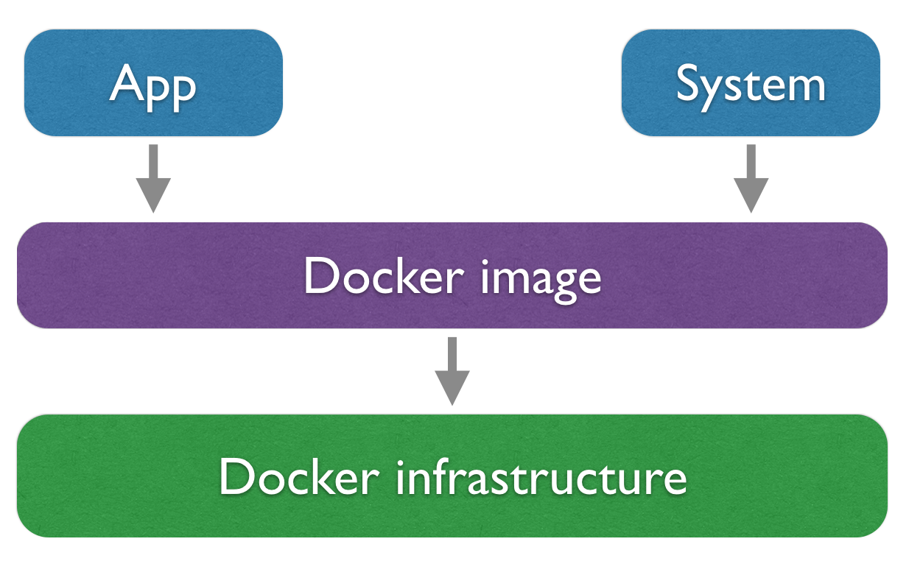

## Using Docker for Testing


[Carlos Sanchez](http://csanchez.org)

[csanchez.org](http://csanchez.org) / [@csanchez](http://twitter.com/csanchez)

<a href="http://cloudbees.com"></a>
<a href="http://www.sstqb.es/"></a>

<!-- <a href="http://cloudbees.com/jenkinsworld"></a> -->

<!-- <small>[Watch online at carlossg.github.io/presentations](https://carlossg.github.io/presentations)</small>
 -->

---


# About me

Engineer @ CloudBees, scaling Jenkins
&nbsp;&nbsp;&nbsp;&nbsp;&nbsp;&nbsp;&nbsp;


Long time OSS contributor at Apache (Apache Maven), Jenkins, Eclipse, Puppet,…


---


----

# Containers

* Linux containers
* File System
* Users
* Processes
* Network


----

> EVERYTHING at Google runs in a container

> Starts over two billion containers per week

----


# Docker Docker Docker


----

## But it is not trivial


<!--

-->

----


## Operating Systems
### Engine Support

The Engine runs the containers

* Linux
* Windows

----

## Operating Systems
### Client Support

The client talks to the engine through an API

* Linux
* OS X
* Windows

----

## Build once
## run anywhere

Bare metal

Virtual Machines

Cloud

----

# Developer Oriented

Dependency hell

Installation nightmares

_"it ran on my machine"_

----

# Ops Oriented

No need to know internals of apps

Focus on OPs problems (scale, monitoring,…)

Clearer deliverables from dev

----



----


----


---


# Related Projects

----

# Docker Machine

Provision Docker engines in virtual machines

* Amazon EC2
* Microsoft Azure
* Google Compute Engine
* OpenStack
* Rackspace
* VMware

----

# Docker Compose

Define multi container applications

```yaml
version: '3'
services:
  web:
    build: .
    ports:
    - "5000:5000"
    volumes:
    - .:/code
    - logvolume01:/var/log
    links:
    - redis
  redis:
    image: redis
volumes:
  logvolume01: {}
```


----

# Orchestrators


---


# Docker and Selenium

----

Manage multiple combinations of browsers

Any number of them

Standalone or Selenium Hub
  even with VNC

----


----


----

# Selenium Hub

```yaml
docker run -d -p 4444:4444 --name selenium-hub selenium/hub:3.4.0
docker run -d -p 5901:5900 --link selenium-hub:hub \
    selenium/node-chrome-debug:3.4.0
docker run -d -p 5902:5900 --link selenium-hub:hub \
    selenium/node-firefox-debug:3.4.0
```


---


# Graciñas

[csanchez.org](http://csanchez.org)

 [csanchez](http://twitter.com/csanchez)

 [carlossg](https://github.com/carlossg)

