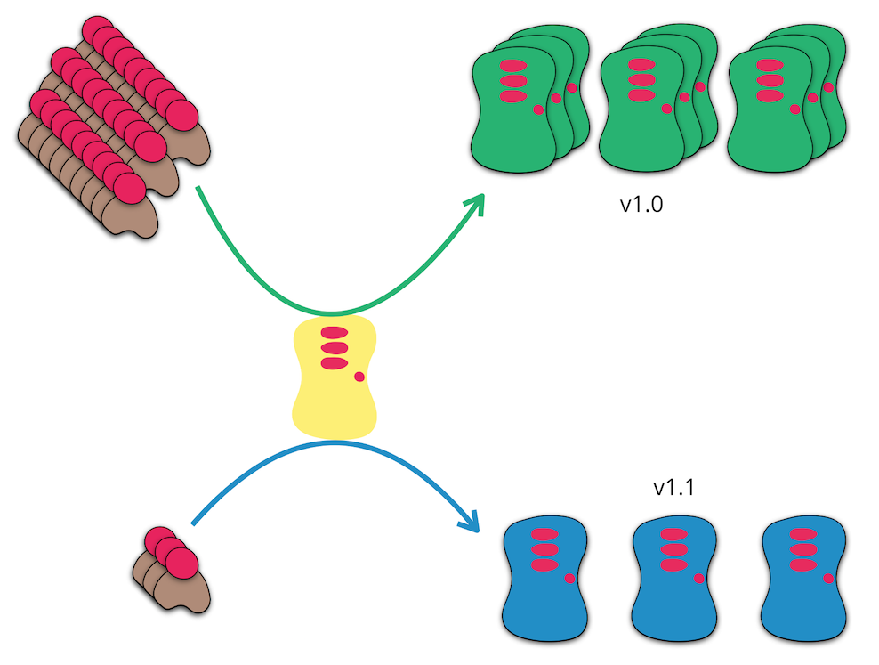

# About me

Engineer @ CloudBees, Scaling Jenkins

Author of Jenkins Kubernetes plugin

Contributor to Jenkins and Maven official Docker images

Long time OSS contributor at Apache Maven, Eclipse, Puppet,…

---

# Micro Services

> the microservice architectural style is an approach to developing a single application as a suite of **small services**,
each running in its own process and **communicating with lightweight mechanisms**, often an HTTP resource API.

----

> These services are built around **business capabilities** and **independently deployable** by fully automated deployment machinery.

<small>James Lewis and Martin Fowler</small>

----

* One application, multiple small services
* Separate processes with lightweight comunications, typically HTTP
* Deployed independently
* Minimal centralized management
* Fully automated deployment

----

### Monolith vs Micro-Services

----

#### Componentization via Services

vs libraries

----

#### Organized around Business Capabilities

cross functional teams

#### Products not Projects

business oriented

ongoing maintenance

----

<!-- #### Smart endpoints and dumb pipes

vs ESB

decoupled and cohesive

----
-->

#### Decentralized Governance

different lenguages

Amazon: you build it you run it

----

#### Decentralized Data Management

each service manages its own database

----

#### Infrastructure Automation

Continuous Delivery

----

#### Evolutionary Design

modular design and replaceability

----

#### Design for failure

resiliency and self-healing

----

<!-- <small>[https://martinfowler.com/articles/microservices.html](https://martinfowler.com/articles/microservices.html)</small> -->

* Rapid provisioning
* Basic monitoring
* Rapid application deployment - DevOps Culture

<small>[https://martinfowler.com/bliki/MicroservicePrerequisites.html](https://martinfowler.com/bliki/MicroservicePrerequisites.html)</small>

----

## Organizational Structure

> Any organization that designs a system will inevitably produce a design whose structure is a copy of the organization's communication structure.

<small>Conway's Law</small>

---

## Continuous Deployment

The first 90%

* Develop
* Build
* Test
* Deploy

----

## Continuous Deployment

The other 90%

* Monitor
* React to problems
* Prevent problems

----

### Automation
### Automation
### Automation

----

----

> If you haven't automatically destroyed something by mistake, you are not automating enough

----

## Deploy without downtime

* Blue-Green deployment
* Canary deployment

----

----

[]](https://blog.snap-ci.com/blog/2015/06/22/continuous-deployment-strategies/)

----

Monitoring is the new testing

----

Use data from monitoring

Take proactive actions, ie. scaling

----

# (Auto)Scaling

New and interesting problems

----

## Example: AWS

Infinite capacity

----

## Example: AWS

Resource limits: VPCs, snapshots, some instance sizes

Rate limits: affect the whole account

----

## Example: AWS

Always use different accounts for testing/production and possibly different teams

Retrying is your friend, but with exponential backoff

----

# Pets vs Cattle

----

> How would you design your infrastructure if you couldn't login? Ever.

<small>Kelsey Hightower</small>

<!--
## Pets vs Cattle vs Chicken

<small>[http://www.cloudcomputingexpo.com/node/3293710](http://www.cloudcomputingexpo.com/node/3293710)</small>
-->

----

## Stateful Services are Hard

Inherently

Do your services need to be deployed in a specific order?

----

Adding more replicas to services is not trivial

- data needs to be synced across replicas
- what if you kill a master node vs a replica

---

# Resilient & Self Healing Systems

----

Services need to auto adapt to changes and errors

In case of unexpected errors, try to adapt and restore to working condition

----

Never expect an order of deployment

Will your app crash if database is not yet up and running?

----

In case your database is down, what would you do?

1. send an alert and fail fast
2. keep trying

----

Services need to retry calls

Can conflict with fail-fast

----

In complex systems there is no single cause of failure

----

## Embrace failure!

----

## The Principles of Chaos Engineering

[principlesofchaos.org](http://principlesofchaos.org/)

* Build a Hypothesis around Steady State Behavior
* Vary Real-world Events
* Run Experiments in Production
* Automate Experiments to Run Continuously

----

----

## FIT : Failure Injection Testing

Middle ground between isolated testing and large scale chaos exercises

<small>[http://techblog.netflix.com/2014/10/fit-failure-injection-testing.html](http://techblog.netflix.com/2014/10/fit-failure-injection-testing.html)</small>

---

# Micro Services and Containers

----

----

----

## But it is not trivial

<!--

-->

----

## Cluster Orchestration

Allow running services in cluster

Abstract underlying infrastructure

High availability

Handle persistence for you

Network isolation and SDNs

----

---

# Hvala!

[csanchez.org](http://csanchez.org)

 [csanchez](http://twitter.com/csanchez)

 [carlossg](https://github.com/carlossg)

