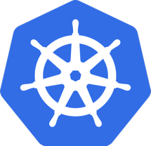

## Scaling Jenkins with Kubernetes

Carlos Sanchez

[csanchez.org](http://csanchez.org)

[@csanchez](http://twitter.com/csanchez)

<a href="http://cloudbees.com"></a>

<!-- <small>[Watch online at carlossg.github.io/presentations](https://carlossg.github.io/presentations)</small> -->

---

# About me

Principal Software Engineer @ CloudBees

Author of Jenkins Kubernetes plugin

Long time OSS contributor at Apache Maven, Eclipse, Puppet,…


---


# Our use case


Scaling Jenkins

<small>Your mileage may vary</small>

----


----

## But it is not trivial


<!--

-->

<!--

> How would you design your infrastructure if you couldn't login? Ever.

> Kelsey Hightower


## Cluster Scheduling

* Running in public cloud, private cloud, VMs or bare metal
* HA and fault tolerant
* With Docker support of course

<!--


## Embrace failure!


-->

---


# Scaling Jenkins

Two options:

* More agents per master
* More masters

----

### Scaling Jenkins: More Agents

* Pros

 * Multiple plugins to add more agents, even dynamically

* Cons

 * The master is still a SPOF
 * Handling multiple configurations, plugin versions,...
 * There is a limit on how many agents can be attached

----

### Scaling Jenkins: More Masters

* Pros

 * Different sub-organizations can self service and operate independently

* Cons

 * Single Sign-On
 * Centralized configuration and operation

----

### [CloudBees Core](https://www.cloudbees.com/products/cloudbees-core)


The best of both worlds

CloudBees Jenkins Operations Center with multiple masters

Dynamic agent creation in each master

<!--

### [CloudBees Jenkins Enterprise](https://www.cloudbees.com/products/cloudbees-jenkins-enterprise)


-->

---


#  & 

----

We can run both Jenkins **masters and agents** in Kubernetes

----

# Storage

Handling distributed storage

Masters can move when they are restarted

Jenkins masters need persistent storage, agents (_typically_) don't

Using `PersistentVolumeClaim` so you can provide any implementation

----

## Caveats

* Performance

> "Worst-case scenario for just about any commonly used network-based storage"

* Lack of multi-AZ for block storage, ie. EBS AWS

----

# Networking

Jenkins masters open several ports

* HTTP
* JNLP agent

----

## Networking: HTTP

We use ingress rules and `nginx` ingress controller

* Operations Center
* Jenkins masters

Path based routing `cje.example.com/master1`

----

## Networking: JNLP

* Agents started dynamically in cluster can connect to masters internally
* Agents manually started outside cluster connect directly
 * Using `NodePort`

---


## Agents with Infinite* Scale!

[Jenkins Kubernetes Plugin](https://wiki.jenkins-ci.org/display/JENKINS/Kubernetes+Plugin)

* Dynamic Jenkins agents, running as Pods
* Multi-container support
  * One Jenkins agent image, others custom
* Jenkins Pipeline support for both agent Pod definition and execution
* Persistent workspace
* Auto configured

----

## On Demand Jenkins Agents

```groovy
podTemplate(label: 'mypod') {
  node('mypod') {
    sh 'Hello world!'
  }
}
```

----

## Grouping Containers (Pods)

```groovy
podTemplate(label: 'maven', yaml: """
spec:
  containers:
  - name: maven
    image: maven:3.3.9-jdk-8-alpine
    command:
    - cat
    tty: true
"""
) {

  node('maven') {
    stage('Get a Maven project') {
      git 'https://github.com/jenkinsci/kubernetes-plugin.git'
      container('maven') {
        stage('Build a Maven project') {
          sh 'mvn -B clean package'
        }
      }
    }
  }
}
```

----

## Using Declarative Pipeline

```groovy
pipeline {
  agent {
    kubernetes {
      label 'mypod'
      yaml """
spec:
  containers:
  - name: maven
    image: maven:3.3.9-jdk-8-alpine
    command: ['cat']
    tty: true
"""}}
  stages {
    stage('Run maven') {
      steps {
        container('maven') {
          sh 'mvn -version'
        }
      }}}
}
```

----

### Multi-language Pipeline

```groovy
podTemplate(label: 'maven-golang', yaml: """
apiVersion: v1
kind: Pod
spec:
  containers:
  - name: maven
    image: maven:3.3.9-jdk-8-alpine
    command: ['cat']
    tty: true
  - name: golang
    image: golang:1.8.0
    command: ['cat']
    tty: true
""") {
```

----

### Multi-language Pipeline

```groovy
  node('maven-golang') {
    stage('Build a Maven project') {
      git 'https://github.com/jenkinsci/kubernetes-plugin.git'
      container('maven') {
        sh 'mvn -B clean package' }}

    stage('Build a Golang project') {
      git url: 'https://github.com/hashicorp/terraform.git'
      container('golang') {
        sh """
        mkdir -p /go/src/github.com/hashicorp
        ln -s `pwd` /go/src/github.com/hashicorp/terraform
        cd /go/src/github.com/hashicorp/terraform && make core-dev
        """
      }}}}
```

----

## Pods: Selenium

Example:

* Jenkins agent
* Maven build
* Selenium Hub with
  * Firefox
  * Chrome

5 containers

----

```groovy
podTemplate(label: 'maven-selenium', yaml: """
apiVersion: v1
kind: Pod
spec:
  containers:
  - name: maven-firefox
    image: maven:3.3.9-jdk-8-alpine
    command: ['cat']
    tty: true
  - name: maven-chrome
    image: maven:3.3.9-jdk-8-alpine
    command: ['cat']
    tty: true
  - name: selenium-hub
    image: selenium/hub:3.4.0
"""
```

----

```yaml
  // because containers run in the same network space, we need to
  // make sure there are no port conflicts
  // we also need to adapt the selenium images because they were
  // designed to work with the --link option

  - name: selenium-chrome
    image: selenium/node-chrome:3.4.0
    env:
    - name: HUB_PORT_4444_TCP_ADDR
      value: localhost
    - name: HUB_PORT_4444_TCP_PORT
      value: 4444
    - name: DISPLAY
      value: :99.0
    - name: SE_OPTS
      value: -port 5556
```

----

```yaml
  - name: selenium-firefox
    image: selenium/node-firefox:3.4.0
    env:
    - name: HUB_PORT_4444_TCP_ADDR
      value: localhost
    - name: HUB_PORT_4444_TCP_PORT
      value: 4444
    - name: DISPLAY
      value: :98.0
    - name: SE_OPTS
      value: -port 5557
```

----

```groovy
  node('maven-selenium') {
    stage('Checkout') {
      git 'https://github.com/carlossg/selenium-example.git'
      parallel (
```

----

```groovy
        firefox: {
          container('maven-firefox') {
            stage('Test firefox') {
              sh """
              mvn -B clean test -Dselenium.browser=firefox \
                -Dsurefire.rerunFailingTestsCount=5 -Dsleep=0
              """
            }
          }
        },
```

----

```groovy
        chrome: {
          container('maven-chrome') {
            stage('Test chrome') {
              sh """
              mvn -B clean test -Dselenium.browser=chrome \
                -Dsurefire.rerunFailingTestsCount=5 -Dsleep=0
              """
            }
          }
        }
```

---


# Deploying to Kubernetes

----


----

> If you haven't automatically destroyed something by mistake, you are not automating enough

----

## Jenkins X


----


---


## Serverless Jenkins

* Pay per use
* "Infinite" scale
* Scale to zero
* Minimal operation costs

---


[csanchez.org](http://csanchez.org)

 [csanchez](http://twitter.com/csanchez)&nbsp;
 [carlossg](https://github.com/carlossg)

[](http://cloudbees.com)
